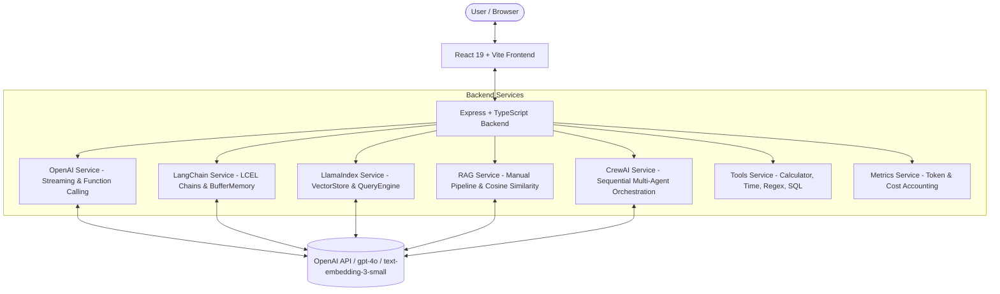

# 🤖 AI Agent Studio — Production-Quality AI Engineering Showcase

[](https://react.dev/)
[](https://www.typescriptlang.org/)
[](https://nodejs.org/)
[](https://vitejs.dev/)
[](https://tailwindcss.com/)
[](https://platform.openai.com/)
[](https://js.langchain.com/)
[](https://ts.llamaindex.ai/)

**AI Agent Studio** is a full-stack, production-grade AI showcase application designed for AI Engineer technical interviews. It provides live, interactive implementations of modern AI engineering patterns: **LangChain.js**, **LlamaIndex.TS**, **CrewAI-style Multi-Agent Orchestration**, **Manual RAG Pipelines**, **OpenAI Function Calling**, **SSE Streaming**, and **Real-Time Token/Cost Tracking** — wrapped in a high-end, glassmorphic SaaS dashboard.

---

## 📸 Screenshots & Feature Walkthrough

| Feature | Key Technologies | Description |
|---|---|---|
| **AI Dashboard** | Recharts, Zustand, In-Memory Metrics | Live tracking of requests, response latency, token consumption, model cost breakdown, and active agents |
| **AI Chat Assistant** | SSE Streaming, EventSource, ReactMarkdown | Character-by-character response streaming, syntax highlighting, conversation history, and persona switching |
| **Agent Selection** | Custom System Prompts, Agent Personas | 6 specialized agents: Software Engineer, Frontend Dev, Code Reviewer, Project Manager, BA, Technical Writer |
| **Tool Calling** | OpenAI Function Calling API, mathjs | Function calling with 9 tools: Calculator, Time, JSON Formatter, Regex, SQL, Email, JS, React, API Docs |
| **CrewAI Demo** | Multi-Agent Sequential Pipeline | 5-agent workflow: BA → System Architect → Frontend → Backend → QA → Executive Summary |
| **LangChain Demo** | LCEL, PromptTemplate, BufferMemory | Visual chain execution: `ChatPromptTemplate \| ChatOpenAI \| StringOutputParser` + `ConversationChain` |
| **LlamaIndex Demo** | VectorStoreIndex, RetrieverQueryEngine | PDF/Text upload, node chunking, vector indexing, node similarity retrieval, and answer synthesis |
| **RAG Pipeline** | MemoryVectorStore, Cosine Similarity | Step-by-step animated RAG: Upload → Chunking → Embedding → VectorDB → Retrieval → Prompt → LLM → Answer |
| **Prompt Playground** | Parameters, A/B Side-by-Side | Experiment with Temperature, Top P, Max Tokens, System/User Prompts, and compare 2 model configs |
| **Activity Timeline** | Event Logging, Metrics Service | Real-time audit log of every AI operation with duration, token counts, and estimated cost |
| **Settings** | LocalStorage, API Validation | Client-side API key management and live model switching (GPT-4o, GPT-4o-mini, GPT-4.1, GPT-4-turbo) |

---

## 🏛️ System Architecture



---

## ⚡ Quick Start & Installation

### Prerequisites
- Node.js 20.0 or higher
- An OpenAI API key (`sk-...`)

### 1. Clone & Set Up Server

```bash
cd server
npm install --legacy-peer-deps
npm run dev
```
*Server starts on `http://localhost:3001`*

### 2. Set Up Client

In a new terminal:

```bash
cd client
npm install --legacy-peer-deps
npm run dev
```
*Client starts on `http://localhost:5173`*

### 3. Configure API Key
1. Open `http://localhost:5173` in your browser.
2. Click **Settings** in the left sidebar.
3. Paste your OpenAI API Key and click **Validate & Save**.

---

## 📁 Repository Structure

```
d:\AiWebsite\
├── client/                     # React 19 + Vite Frontend
│   ├── src/
│   │   ├── api/                # Typed Axios API fetchers (chat, tools, crew, rag, etc.)
│   │   ├── components/
│   │   │   └── layout/         # Sidebar, Topbar, Layout wrapper with glassmorphism
│   │   ├── hooks/              # Custom hooks (useChat SSE, useCrewRun SSE)
│   │   ├── lib/                # Utility functions, formatters, cn helper
│   │   ├── pages/              # 11 Feature pages (Dashboard, Chat, Crew, RAG, etc.)
│   │   ├── store/              # Zustand global store (API key, model, settings)
│   │   ├── types/              # Client TypeScript interfaces
│   │   ├── App.tsx             # React Router setup & QueryClientProvider
│   │   ├── index.css           # Tailwind design tokens, animations, markdown styles
│   │   └── main.tsx            # React root mount
│   ├── index.html              # HTML shell with Google Fonts & SEO meta tags
│   ├── package.json
│   ├── tailwind.config.js      # Custom design system tokens (slate, violet, cyan)
│   └── vite.config.ts          # Vite build config with path alias (@/*) and server proxy
│
└── server/                     # Node.js + Express + TypeScript Backend
    ├── src/
    │   ├── agents/             # Agent definitions (role, goal, system prompt, tools)
    │   ├── middleware/         # Global error handler & request metrics logger
    │   ├── routes/             # Express API endpoints (/chat, /tools, /crew, /rag, etc.)
    │   ├── services/           # Core AI service logic
    │   │   ├── crew.service.ts         # Multi-agent sequential execution
    │   │   ├── langchain.service.ts    # LCEL chain & BufferMemory
    │   │   ├── llamaindex.service.ts   # Document parsing, vector indexing & Q&A
    │   │   ├── metrics.service.ts      # In-memory request, token & cost tracking
    │   │   ├── openai.service.ts       # OpenAI SDK wrapper (streaming & embeddings)
    │   │   ├── rag.service.ts          # Manual RAG: chunking, embedding, cosine search
    │   │   └── tools.service.ts        # Tool execution implementations
    │   ├── tools/              # OpenAI Function Calling schemas
    │   ├── types/              # Server TypeScript interfaces
    │   └── index.ts            # Express server entry point
    ├── package.json
    └── tsconfig.json
```

---

## 🎓 How to Present This Project in an AI Engineer Interview

### 1. The Elevator Pitch (30 Seconds)
> *"I built AI Agent Studio to demonstrate hands-on production mastery across the modern AI engineering stack. Rather than just wrapping an LLM endpoint, it showcases multi-agent workflows (CrewAI pattern), retrieval pipelines (RAG & LlamaIndex), LangChain chain composition, function calling with 9 execution tools, and real-time observability — all wrapped in an enterprise SaaS dashboard."*

### 2. Highlighting Architectural Decisions (2 Minutes)

- **Streaming Architecture (SSE vs WebSockets)**:
  - *"I chose Server-Sent Events (SSE) for LLM response streaming and multi-agent step progress because SSE is unidirectional, lightweight over standard HTTP, natively handles reconnection, and works seamlessly with standard reverse proxies without WebSocket state overhead."*

- **RAG Pipeline Implementation (Framework vs Manual)**:
  - *"I built two RAG implementations: a manual pipeline to show exact mathematical mechanics (character chunking with 50-char overlap, batch embeddings via `text-embedding-3-small`, and vector cosine similarity scoring), and a LlamaIndex.TS implementation to show high-level framework productivity."*

- **Multi-Agent Sequential Context Flow**:
  - *"The CrewAI demo shows sequential context passing. Each agent (Business Analyst → Architect → Frontend → Backend → QA) receives the accumulated system requirements from prior agents in its context window, ensuring cohesive software specifications."*

- **Observability & Cost Management**:
  - *"Every API call logs token counts, response latency, and calculates estimated USD cost using model-specific rate tables. This mimics production AI monitoring platforms like LangSmith or Helicone."*

---

## ❓ 30 Key AI Interview Questions & Answers

See [INTERVIEW_QUESTIONS.md](INTERVIEW_QUESTIONS.md) for 30 curated technical interview Q&As covering:
- Transformer Architectures & Attention Mechanisms
- RAG vs Fine-Tuning trade-offs
- Chunking strategies & Overlap selection
- Vector Search algorithms (HNSW, Cosine vs Dot Product vs Euclidean)
- Multi-Agent Orchestration strategies
- Function Calling reliability & structured outputs
- Hallucination prevention techniques

---

## 📜 License

MIT License — free to use for interview preparation, portfolio demonstration, or enterprise reference.
